# devsign

^ As iOS developers, we have lived through a number of revolutions over the years.

--- 

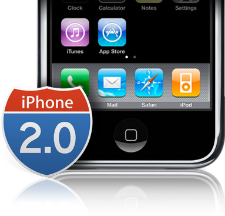
# 2008

^ First there was the revolution of 2008, when we could develop native apps for the iPhone OS for the first time.

---

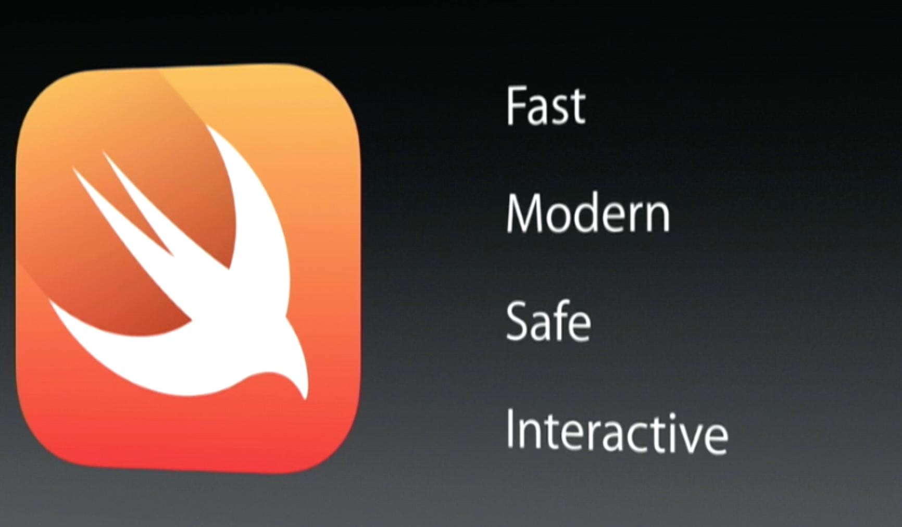
# 2014

^ Recently there was the revolution of 2014, where we got a brand new programming language: Swift.

---

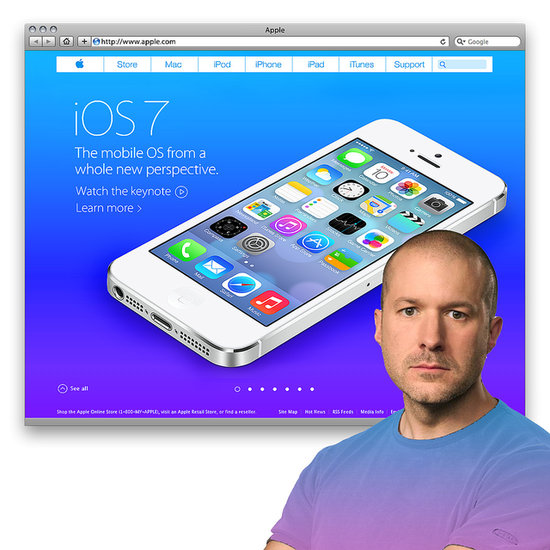
# 2013

^ But to me personally, the most significant and exciting revolution, was the revolution of 2013, when Jony Ive gave a keynote at WWDC that introduced the brand new design mindset of iOS 7.

^ With a single grand stroke, Jony officially banished skeumorphism from the ecosystem. 

---

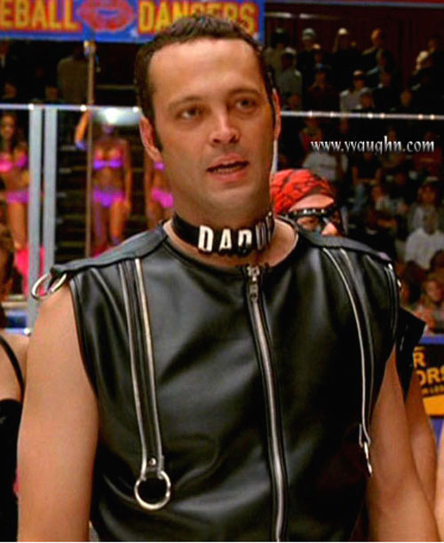
## "... this isn't what we ordered"

^ It was a sad day for leatherworkers across the world.

---

> Design... 
> It's the whole thing,
> **the way something actually works**. 
-- Jony Ive

^ In its place Jony introduced a new "flat" style focused on clarity, deference, and depth. He explained it like this:

^ "We have always thought of design as being so much more than **the way something looks**. It's the whole thing, **the way something actually works**." - Jony Ive

^ This really spoke to me as a developer with dormant design sensibilities.

^ I've always been amazed by graphic designers and their technical prowess, but at the same time I was always too scared to really try and create something in their medium.

---

## Just like real life!
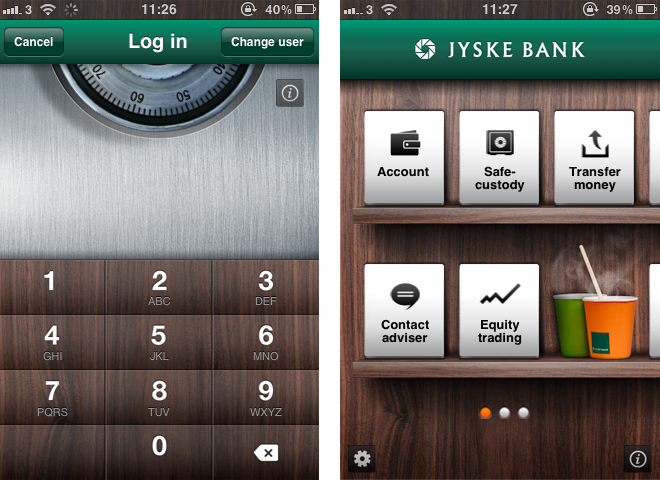

^ Skeumorphism scared me off even further, because back then apps were distinguished by who had *the most realistic wood effect* in their UI, and I could barely draw a stick figure. 

---

## adding leather/wood ≠ important

^ And then after that specific keynote, just like that, none of that matters anymore. The *leather and wood are gone* and we're told that design is not just about the way something looks. 

^ This was great news for me, because I no longer had to be scared about being a Photoshop/Illustrator *n00b*.

---

## making things work = important

^ Even better, I was told that design encompasses the way something actually works. 

^ And what do we do as iOS developers? *We make things work*. 

^ Our apps may look ugly, they may be a little hard to use, but hey, with just a limited set of tools we can actually make things work. 

---

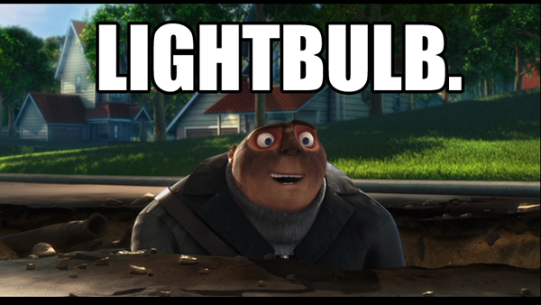

^ So after that keynote by Jonny Ive, I had a true lightbulb moment.

^ I realized that if my skills at making things work are essential to an app's design, then I want to make my apps work *really well*, even if I have to dip just a little bit into what's traditionally considered design territory.

---

### and I hope you do too

^ And I hope you do too.

---

## devsign
## =
## design-centric development

^ The aim of this talk is to encourage you to become a design-centric developer, with the ability to shape your app's design as it's being developed. 

^ The ability to devsign is becoming increasingly important as software production moves from staged waterfall models to collaborative agile ones. 

^ App teams are usually quite small and require great communication, so the ability to understand your team-mates and work towards the same goal is paramount. No matter what each of your disciplines or skills may be.

---

## Designers & Developers

^ Designers and developers are usually seen as polar opposites: Right-brain vs Left-brain. However, there are many similarities between us like being analytical, solving problems, loving coffee, and hating glare.

^ I could list many more, believe it or not, but the one that truly matters and can mend any differences is this: designers and developers are both passionate about making great apps. 

^ We will push and pull on each other in equal measure because creating an app is not an entirely linear handoff process until it ships, it's an interwoven journey that you must embark upon as a cohesive unit. 

^ As we move along, you'll notice that two things will always hold true: 

---

### design will create new *demands* for development

^ *design will create new demands for development,* 

---

### development will reveal *gaps* in design

^ *and development will reveal gaps in design*

---

### so...

^ So... 

^ How do you improve harmony and increase alginment with designers?

^ Where do you start if you're short on resources?

^ Why should you approach development with a design-centric mindset?

^ Well, there are many different subsets of design that tackle specific challenges, but i'll give you a quick tour of the 4 main design disciplines:

---

# product

^ Product

---

# interaction

^ Interaction

---

# visual

^ Visual

---

# user experience

^ User Experience

---

## "... say what?"

^ For each of these, I will offer a basic definition and simplified overview, along with a few tips on how, as a developer, you can influence key design decisions at each stage of app production. 

^ In general, these disciplines flow into one another in the order above, but are all present during the full product lifecycle. 

^ More importantly, your ability to influence the overall production cycle depends on the size and structure of your organization. 

^ For those of you at small startups or indie studios, the ability to juggle many tasks might make or break a product. 

^ For those of you that are part of larger teams in a more corporate environment, the ability to work with several departments will make life much easier!

---

## product design
### "what should the app *do*?"

^ The first step in making an app involves product design.

^ In this stage, you want to figure out *what the app should do*, at a high level.

^ This is a good time to take a look at the competition, see what features their apps have, look at their reviews, and see if there's any common things that people love or hate about those apps.

^ It's also a good time to make sure that an app fits in well with your company or client's overall strategy, and that it's worth the time, money, and effort to make it in the first place. 

---

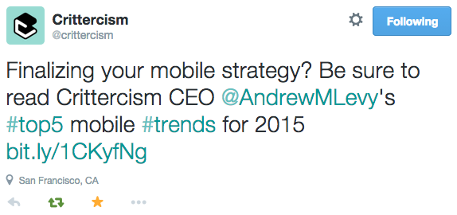

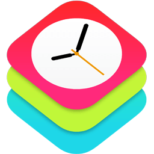
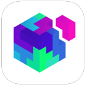

^ To start with, you can... constantly read about your industry, take a larger interest in your competitors, investigate cross-product collaboration, look ahead to emerging technologies/trends.

^ As you gain experience, you should... try to integrate new APIs into existing features, or think of new features altogether, then pitch them to your team.

^ Once you've mastered this stage, you can expect to... participate in sales pitches or budget discussions, help scope out a new project, inform decision on adding/dropping a feature based on your technical expertise.

---
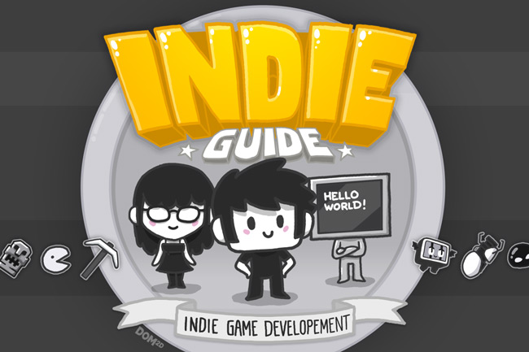

^ Now, if you're a small company or an indie and you're doing the product design yourself, make sure to actually dedicate plenty of time to this stage.

^ It's really easy as developers to get excited about a new idea and want to jump in straight away - because like I said, we know how to make things.

^ But it's just as important to figure out if something is worth doing in the first place and how you can distinguish yourself from the competition, and that's what this phase is all about.

^ Simply remember to be very receptive to new ideas and make decisions that benefit the product, not your own programming interests.

---

## interaction design
### "how should the app be *used*?"

^ The next step you'll encounter is interaction design.

^ In this stage, you want to figure out *how the app should be used*, at the UI level.

^ This is the time to think about how many screens you'll have, what your I/O points will be, and devise a logical flow between all the different features of your app in terms of UI components.

^ This is also a great time to think of common patterns and expected behaviors in human<->computer interaction, without resorting to needlessly complex gestures or screens to accomplish a task.

---

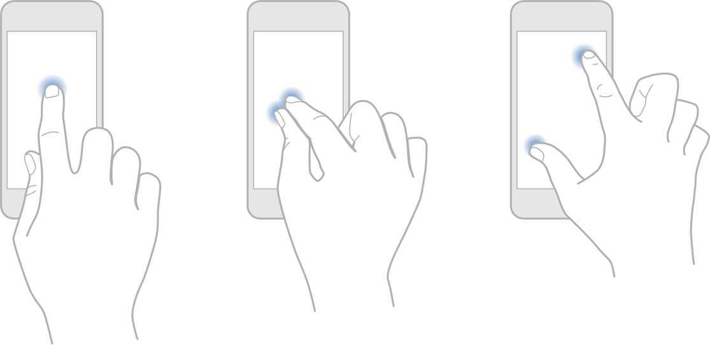

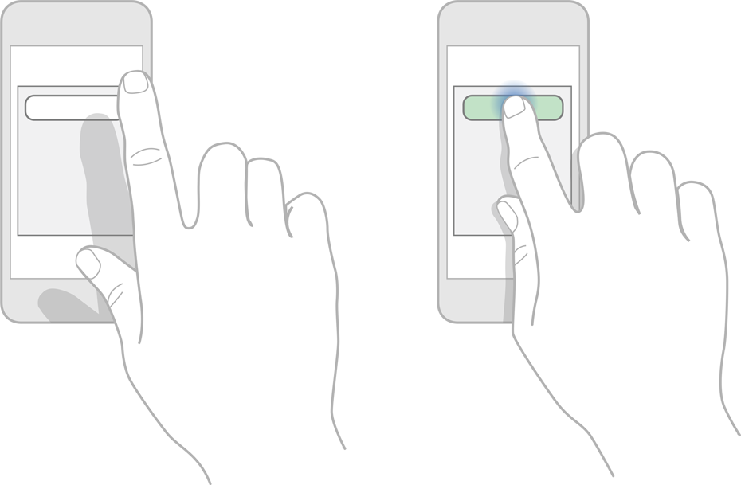

^ For starters... stick to iOS platform patterns, get comfortable with all view controllers, segues, and actionable components.

^ When you feel more confortable, you can then... engage in rapid prototyping and analyze the advantages/disadvantages of different navigation solutions, such as Navigation Controller, Tab Bar Controller, and Page View Controller.

^ And if all that is too easy, you can try to... define the navigation hierarchy, UI components, and gesture recognizers; potentially redefine a complex interaction with a simple custom control.

---

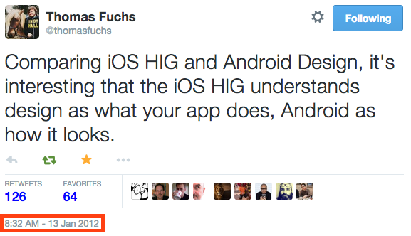

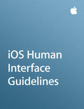

^ At this point I imagine many of you, specially the indie devs, are thinking "If this is Interaction Design, then I'm definitely an Interaction Designer!"... and this is certainly true to a large degree.

^ For iOS developers at least.

^ Thanks to Apple's Human Interface Guidelines, UIKit, and their tightly controlled ecosystem, we can put our trust in well-defined platform patterns and user expectations.

^ However, if you come from old-school desktop development, the wild wild web, or other mobile platforms, you'll know that interaction design can be very complex, largely decentralized, and definitely needs a lot more thought. Sometimes it's total anarchy. It's not always a given and that's where we need the pros. 

^ Not all problems are created equally though, so make sure your app stands out by solving these problems in an easy way; not by making more along the way.

^ And if you really think Apple made it too easy for you, try to dive into *information architecture* for an added challenge :]

---

## visual design
### "how should the app *look*?"

^ Once your interactions are sorted, it's time to make your app beautiful and meaningful with visual design!

^ In this stage, you want to figure out *how the app should look*.

^ This is the time to think about the best presentation of your UI as well as the best representation of its purpose. These are actually two different things that seek a single solution, because the prettiest option may not always be the most adequate one.

^ It's a great time to think about your brand and make sure that the look and feel of your app fits in well with your company's metaphors and customer's emotions. Your choice in color, typography, and layout can really sway a user's review.

---

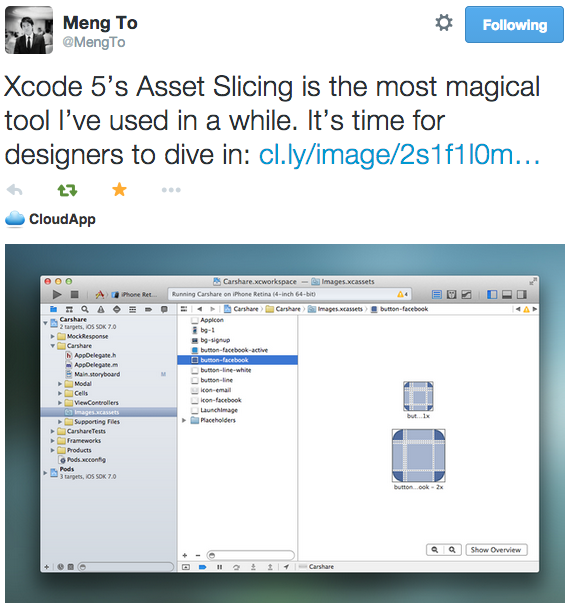

^ You can ease into visual design by getting comfortable within the confines of Xcode, by... turning on canvas rectangles in Interface Builder, using storyboards extensively, and mastering live rendering.

^ Kick it up a notch by... slicing assets, modifying their color, managing typefaces.

^ Finally, those wishing to make "the leap" into graphic design can... make your own visuals, choose action icons, create a launch image, define a color palette.

---

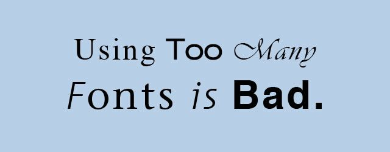

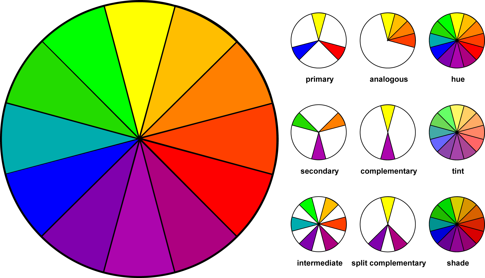

^ While partaking in visual design is less common on a larger team, it's almost a requirement as an indie! 

^ The easiest way to earn a bad review, besides a crash, is to greet your new user with Bright Green Comic Sans. Poor visual design may not affect the usability or performance or your app, but it can certainly make you look like an amateur. 

^ You don't have to become an expert in Photoshop and Illustrator because I know they can be pretty complex, but there are easier options for UI design out there - like Sketch!

^ However, if you can't find the time to learn a new tool, then simply focus on the pursuit of simplicity. Highlight the useful by making it beautiful! And don't forget your Typography and Color Wheel basics :P

---

## user experience design
### "... everything?"

^ Finally, we've reached the hot-topic of UX design...

^ UX design is the process of enhancing user satisfaction with your product by improving its usability. Therefore, it's the most empowering and accessible discipline to us developers.

^ And not only us but all of your teammates as well, because user experience is defined by any and all exchanges between a user and an app.

^ So, whether you've been aware of it or not, anything you've implemented that affects your user is considered UX design.

^ Designer purists will berate me for this, but I think that, in many ways... 

---

> devs are the ultimate gatekeepers of ux
-- Me

^ ... developers are the ultimate gatekeepers of UX.

^ Why? Well, users can't interact with an idea, they can't shop with sketches, and they can't message through a .psd.

---

# iOS .ipa ≠ 
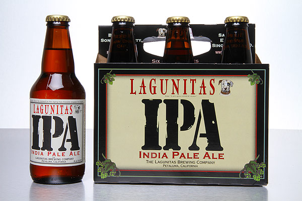

^ But, they can definitely use an .ipa. 

^ As mentioned in the beginning, developers have the ability to make something that works and we can ship it too - no matter how ugly it looks, how hard it is to use, or how badly it performs in the app store.

^ At least it's out there as a full-fledged app. 

---

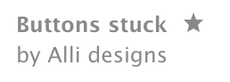

^ Furthermore, a lot of UX is defined by the responsiveness of your app. For example, asynchronous networking and 60 FPS animations are benchmarks of great UX, both defined by technical metrics that live within the developer's code. 

^ So, the easiest path for you to "devsign for UX" is to view your implementation from a user's point of view and make any future decisions with this mindset.

^ Reduce your crashes. Improve performance. Listen to your users, observe their behaviours, incorporate their feedback, and anticipate their reactions.

---

# ux = home

^ UX is your home. Indie or Big. Seasoned or New. This is what you do day-in and day-out, though you might not have realized it :]

---

### p + dev 
### =
### tangible ideas

^ P + Dev = Tangible ideas
^ Able to validate feasibility of new features

---

### i + dev
### =
### quick prototypes

^ I + Dev = Quick prototypes
^ Can compare several solutions with ease

---

### v + dev
### =
### beautiful interfaces

^ V + Dev = Beautiful interfaces
^ Whatever you make will look amazing

---

### p + i + v + dev
### =
### app

^ P + I + V + Dev = App
^ You're in the App Store

---

### bad ux * (p + i + v + dev)
### =
### bad app :[

^ Bad UX * (P + I + V + Dev) = Bad App :[

---

### good ux * (p + i + v + dev)
### =
### good app :]

^ Good UX * (P + I + V + Dev) = Good App :]

---

# dev·sign
### verb \dēv-ˈzīn\

^ I hope you all embrace the opportunity to *devsign*, because iOS developers have a huge advantage over all others.

^ We have incredible design-centric tools like Interface Builder. We have a closed platform that strives for uniformity. We subclass from UIKit.

^ Remember that - like Jony Ive said in the revolution of 2013 - design isn't just about how it looks, but also how it works.

^ The lines between design and development have never been easier to cross.

^ Keep honing your developer craft, but take interest in design too - they are so intertwined.

^ As you do this and begin to tackle some design challenges, you'll realize that developers can be just as creative as designers. 

^ I encourage you to use this opportunity to make your app something that you can be really proud of, on many different levels.